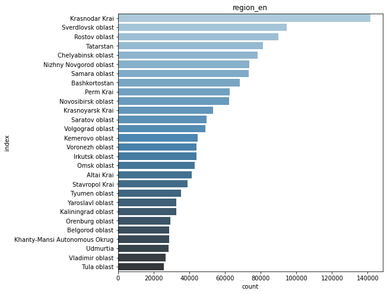
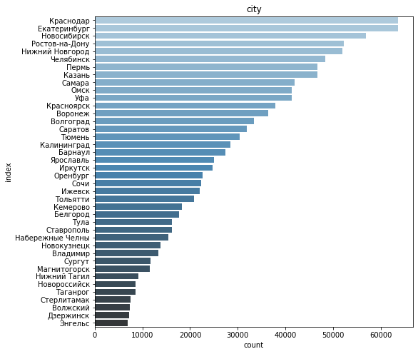
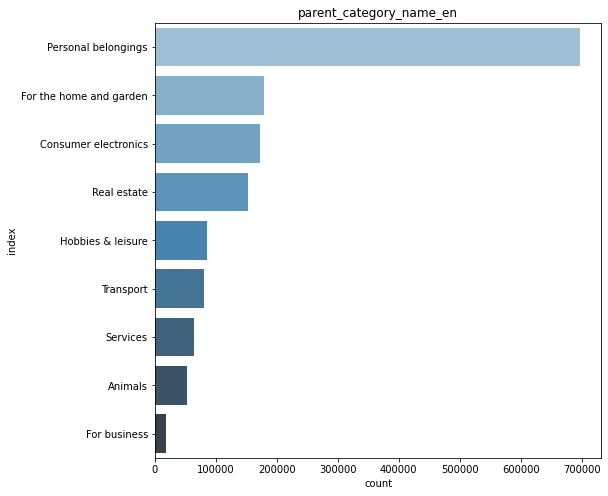
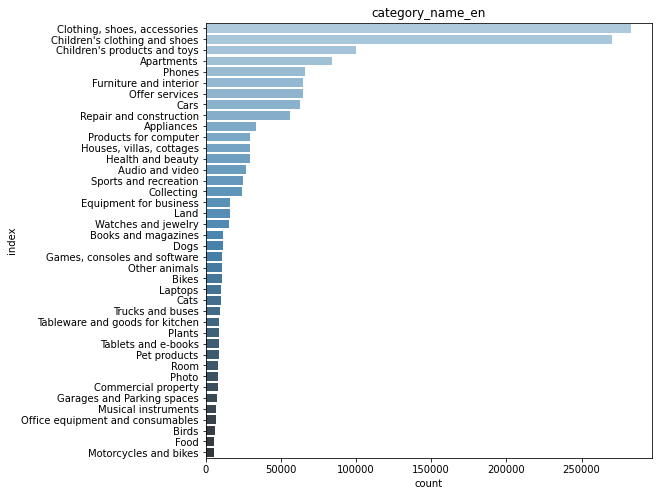
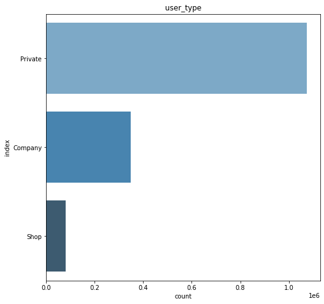
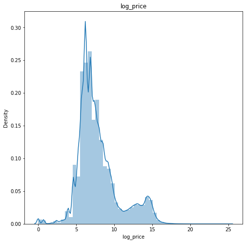

# Avito-Demand-Prediction

Avito Demand Prediction in Python

# Background

Avito.ru is a Russian classified advertisements website with sections devoted to general goods for sale, jobs, real estate, personals, cars for sale, and services. 
One of the challenges to Avito is to predict the demand of certain goods so that it can advise the sellers on the proper price.
Avito is challenging you to predict demand for an online advertisement based on its full description (title, description, images, etc.), its context (geographically where it was posted, similar ads already posted) and historical demand for similar ads in similar contexts. With this information, Avito can inform sellers on how to best optimize their listing and provide some indication of how much interest they should realistically expect to receive.

# Sample Insights

![](samples/7.png
![](samples/8.png
![](samples/9.png

